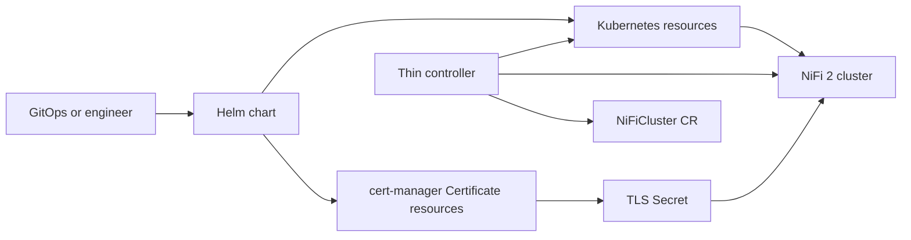

# NiFi-Fabric

`NiFi-Fabric` is a thin, modern platform layer for running Apache NiFi 2.x on Kubernetes.

## Project Summary

This repository packages two evaluator paths around the same NiFi 2-first design:

- a standalone Helm chart for teams that want plain Kubernetes resources and no controller dependency
- an optional managed mode where a thin controller handles rollout safety, TLS drift policy, and hibernation against that same chart-managed `StatefulSet`

It is intentionally not a NiFiKop clone. The current private-alpha focus is a small, explainable platform layer that another engineer can install, evaluate, and debug on kind without first learning a large custom API.

## Hybrid Architecture Summary



Responsibilities are intentionally split:

- Helm owns standard Kubernetes resources, NiFi config templating, PVCs, Services, Secret references, and optional cert-manager `Certificate` resources.
- NiFi native behavior owns Kubernetes-based cluster coordination, shared state where configured, cluster join or rejoin behavior, and TLS autoreload capability.
- The controller owns lifecycle and safety decisions Helm cannot do safely: status conditions, watched-drift observation, managed `OnDelete` rollout sequencing, TLS restart policy decisions, and hibernation or restore orchestration.
- cert-manager owns certificate issuance and renewal when `tls.mode=certManager`; it does not own restart policy.

This means ordinary certificate renewal is not treated as a restart-only operator workflow. Helm declares the `Certificate`, cert-manager renews the Secret, NiFi tries to absorb stable material changes through autoreload, and the controller only restarts when the existing TLS policy says a restart is required.

## Private Alpha Quickstart

Primary local gate:

```bash
make kind-alpha-e2e
```

Phase reruns:

```bash
make kind-e2e-rollout
make kind-e2e-config-drift
make kind-e2e-tls
make kind-e2e-hibernate
```

Focused cert-manager path:

```bash
make kind-cert-manager-e2e
```

CI entrypoints:

- GitHub Actions workflow `alpha-e2e`
- manual `workflow_dispatch` with target selection
- nightly scheduled full run

## Private Alpha Release Notes

What is proven:

- standalone chart install on kind
- managed install on kind
- per-pod NiFi health gate
- managed revision rollout
- watched config-drift rollout
- TLS observe-only path
- restart-required TLS rollout
- hibernation and restore
- focused cert-manager evaluator path on kind

What is not proven:

- AKS runtime validation
- OpenShift runtime validation
- production-hardening guidance
- NiFi image versions beyond the current tested tag
- cert-manager as part of the main `make kind-alpha-e2e` gate

Supported evaluator paths:

- standalone quickstart
- managed quickstart
- focused cert-manager quickstart
- full private-alpha gate with `make kind-alpha-e2e`
- AKS readiness guide for future evaluation with [docs/aks.md](docs/aks.md)
- OpenShift readiness guide for future evaluation with [docs/openshift.md](docs/openshift.md)

Known limitations are called out below and in [docs/local-kind.md](docs/local-kind.md).

## AKS Readiness

AKS is a target platform, but it is not yet validated in this repository.

What exists today:

- an AKS readiness guide in [docs/aks.md](docs/aks.md)
- AKS-oriented starting overlays in:
  - [examples/aks/standalone-values.yaml](examples/aks/standalone-values.yaml)
  - [examples/aks/managed-values.yaml](examples/aks/managed-values.yaml)

What that means:

- the chart and controller are prepared for a first AKS evaluation
- the repository does not yet claim any successful AKS runtime test
- kind remains the only proven automated runtime today

## OpenShift Readiness

OpenShift is a secondary target platform, but it is not yet validated in this repository.

What exists today:

- an OpenShift readiness guide in [docs/openshift.md](docs/openshift.md)
- OpenShift-oriented starting overlays in:
  - [examples/openshift/standalone-values.yaml](examples/openshift/standalone-values.yaml)
  - [examples/openshift/managed-values.yaml](examples/openshift/managed-values.yaml)
- chart-level Route rendering with passthrough termination as the first OpenShift readiness option

What that means:

- the chart is prepared for a first OpenShift evaluation
- the repository does not yet claim any successful OpenShift runtime test
- internal `ClusterIP` readiness remains the first validation step before trusting Route behavior

## Evaluator Prerequisites

Exact local prerequisites for the current private alpha:

- Docker with permission to run `kind` and `docker exec`
- kind
- kubectl
- Helm 3
- Go
- `curl`
- `jq`
- `openssl`
- `python3`

Optional:

- `keytool`
  - if it is missing, `hack/create-kind-secrets.sh` runs `keytool` in a disposable `apache/nifi:2.0.0` container

## Install Paths

Recommended evaluator entrypoints:

- Standalone quickstart
  - use when you only want Helm and a working NiFi 2 cluster
- Managed quickstart
  - use when you want the controller, `NiFiCluster`, and lifecycle orchestration
- Full private-alpha gate
  - use when you want the entire proven workflow on a fresh kind cluster

Example files are indexed in [examples/README.md](examples/README.md).

## Standalone Quickstart

Exact commands:

```bash
make kind-up
make kind-load-nifi-image
make kind-secrets
make helm-install-standalone
make kind-health
```

Primary example:

- [examples/standalone/values.yaml](examples/standalone/values.yaml)

## Managed Quickstart

Exact commands:

```bash
make kind-up
make kind-load-nifi-image
make kind-secrets
make install-crd
make docker-build-controller
make kind-load-controller
make deploy-controller
kubectl -n nifi-system rollout status deployment/nifi-fabric-controller-manager --timeout=5m
make helm-install-managed
make apply-managed
make kind-health
```

Primary examples:

- [examples/managed/values.yaml](examples/managed/values.yaml)
- [examples/managed/nificluster.yaml](examples/managed/nificluster.yaml)

## Full Alpha Gate

Exact command:

```bash
make kind-alpha-e2e
```

Phase-level reruns:

```bash
make kind-e2e-rollout
make kind-e2e-config-drift
make kind-e2e-tls
make kind-e2e-hibernate
```

The project is intentionally hybrid:

- Helm owns standard Kubernetes resources and NiFi configuration templating.
- A lightweight controller owns lifecycle and safety tasks Helm cannot perform safely.
- NiFi 2 native Kubernetes capabilities remain the source of truth for cluster coordination and shared state behavior.

The result should be easier to reason about than a large kitchen-sink operator, easier to run under GitOps, and easier to evolve as NiFi 2.x improves.

## Problem Statement

NiFi on Kubernetes needs two things at once:

- a clear, reviewable way to render ordinary Kubernetes resources
- a safe way to handle cert rotation, health-gated restarts, hibernation, and upgrade sequencing

Pure Helm is good at the first problem and weak at the second. Large operators can solve the second problem, but often by growing into broad APIs that duplicate application behavior, become hard to explain, and drift away from GitOps-friendly workflows.

NiFi 2 changes the design space. It already supports Kubernetes-native cluster coordination and shared state patterns, so a platform layer does not need to recreate those features. This project uses that fact to stay intentionally small.

## Vision

Build the thin NiFi 2 platform layer:

- NiFi 2.x only
- GitOps first
- AKS first, OpenShift-friendly second
- TLS and persistent storage by default
- boring Kubernetes patterns over clever abstractions
- one small operational CRD instead of a large configuration API

## Why Hybrid Helm + Controller

Helm is the right owner for:

- `StatefulSet`
- `Service` and headless `Service`
- `PersistentVolumeClaim`
- `ConfigMap`
- `Secret` references
- `PodDisruptionBudget`
- `ServiceMonitor`
- affinity, tolerations, topology spread, and other scheduling settings
- templated `nifi.properties` and related config files

The controller is still needed for:

- status conditions for operators and GitOps users
- watched Secret and ConfigMap hash detection
- safe rolling restart orchestration
- health-gated upgrade coordination
- hibernation and restore orchestration
- explicit offload and disconnect sequencing before restart or scale-down

NiFi native capabilities remain responsible for:

- Kubernetes-based cluster coordination
- shared state where configured
- cluster join and rejoin behavior
- TLS autoreload capability

## Operating Modes

| Mode | Installed components | Best for | Trade-off |
| --- | --- | --- | --- |
| Standalone chart | Helm chart only | teams that want plain Helm or simple GitOps | no controller-managed status, rollout safety, or hibernation |
| Managed mode | Helm chart + controller + `NiFiCluster` | teams that want safe orchestration and explicit status | requires a thin operational CR and documented controller ownership boundaries |

Managed mode is opt-in. The chart remains installable by itself.

## MVP Scope

The MVP includes:

- a standalone Helm chart for NiFi 2.x on Kubernetes
- an optional namespaced controller
- one namespaced CRD: `NiFiCluster`
- cert-manager integration assumptions
- `ServiceMonitor` support
- secure-by-default TLS-enabled clusters
- persistent volumes for NiFi repositories
- controlled config and cert drift handling
- health-gated rolling restarts and upgrades
- hibernation and restore to the prior running replica count
- explicit status conditions and events

## Non-Goals

This project does not aim to provide:

- Apache NiFi 1.x support
- NiFiKop compatibility or feature parity
- advanced flow deployment management
- user and access policy management CRDs
- NiFi Registry management CRDs
- backup and restore orchestration
- autoscaling logic
- multi-CRD modeling for every platform concern
- hidden automation that changes workloads without clear status or events

## Design Principles

- Prefer NiFi 2 native capabilities over custom controller logic.
- Prefer Helm for ordinary resources.
- Keep the controller thin, explicit, and testable.
- Keep the API boring and small.
- Make GitOps ownership boundaries obvious.
- Treat cert rotation and restart safety as first-class behavior.

## Recommended Repository Structure

After the design pack, the repository should grow into:

- `README.md`
- `TODO.md`
- `docs/`
- `charts/nifi/`
- `api/v1alpha1/`
- `internal/controller/`
- `internal/nifi/`
- `config/crd/`
- `config/rbac/`
- `config/samples/`
- `test/helm/`
- `test/envtest/`
- `test/e2e/`
- `examples/standalone/`
- `examples/managed/`

## Build Order

1. Finalize the design pack and API boundaries.
2. Build the standalone Helm chart and managed-mode chart switch.
3. Add the `NiFiCluster` CRD and status model.
4. Implement target resolution and status-only reconciliation.
5. Implement safe `OnDelete` rollout orchestration.
6. Implement watched Secret and ConfigMap drift handling.
7. Implement policy-driven cert rotation handling.
8. Implement hibernation and restore tracking.
9. Add `envtest`, Helm, and kind coverage.
10. Validate AKS first and document OpenShift-specific adjustments.

## Current Scaffold Status

What is runnable now:

- the standalone Helm chart can render and deploy a minimal real NiFi 2 cluster on kind
- the repo has a single alpha workflow entrypoint: `make kind-alpha-e2e`
- the repo has phase-level fresh-kind alpha targets for rollout, config drift, TLS, and hibernation debugging
- the repo has a focused fresh-kind cert-manager evaluation path: `make kind-cert-manager-e2e`
- the chart wires Kubernetes leader election and ConfigMap-backed cluster state settings through explicit NiFi configuration rather than hidden controller behavior
- the chart mounts persistent repositories, config, Services, and probes suitable for a kind-focused local workflow
- the repo includes a repeatable health-check flow that separates pod readiness, secured API reachability, and actual cluster convergence
- the optional controller can coordinate managed `OnDelete` rollouts one pod at a time for StatefulSet template drift, revision drift, explicitly watched non-TLS config drift, and TLS drift that policy marks restart-required
- the optional controller now coordinates NiFi disconnect and offload before managed pod deletion or replica reduction
- the optional controller can hibernate a managed cluster by capturing the last running replica count, stepping replicas down highest ordinal first, and restoring back to the recorded size
- the repo includes a minimal in-cluster controller deployment path for local kind verification

What is still intentionally stubbed:

- cert-manager has a focused kind evaluation path, but it is still separate from the main private-alpha gate
- production-hardening of chart defaults, auth choices, and storage layouts
- richer restore target memory than `status.hibernation.lastRunningReplicas` plus the current `1` replica fallback

Current alpha status:

- `make kind-alpha-e2e` is green end to end and is the private-alpha gate
- failures dump `NiFiCluster`, `StatefulSet`, pod revision and UID state, controller logs, and relevant events
- CI can upload those diagnostics from `ARTIFACT_DIR` on failure
- the fresh kind workflow preloads `apache/nifi:2.0.0` into the kind node before Helm install so bootstrap does not depend on an in-cluster registry pull

Implementation note for this slice:

- the chart default still keeps NiFi TLS autoreload configurable and off by default for the minimal standalone path
- the managed example enables NiFi TLS autoreload so the local TLS policy flow exercises the intended autoreload-first design
- `tls.mode=externalSecret` remains the default and stays compatible with the existing `nifi-tls` Secret contract
- `tls.mode=certManager` is now an optional chart-managed TLS source that still keeps Secret names, mount paths, and controller TLS policy behavior stable

## TLS Source Modes

The chart now supports two TLS source modes:

| Mode | Helm owns | You still provide | Best for |
| --- | --- | --- | --- |
| `tls.mode=externalSecret` | workload wiring only | a prebuilt PKCS12 TLS Secret | the current private-alpha quickstart and simple GitOps |
| `tls.mode=certManager` | workload wiring plus `Certificate` | a cert-manager issuer, a stable PKCS12 password source, and a `nifi.sensitive.props.key` source | clusters already using cert-manager |

Both modes keep the same mounted Secret name and TLS file paths in the pod:

- the chart mounts exactly one TLS Secret and the controller does not rename it
- the `StatefulSet` still mounts one TLS Secret at `/opt/nifi/tls`
- NiFi still uses `keystore.p12`, `truststore.p12`, and `ca.crt` from that path
- in cert-manager mode, `commonName` now defaults to `<release>.<namespace>.svc.cluster.local` so the certificate subject is never empty
- the controller still treats ordinary TLS material renewal as watched certificate drift and applies the existing autoreload-first policy

The controller does not create or mutate `Certificate` resources. Helm owns that resource; the controller only watches the resulting Secret material and decides whether TLS drift resolves through autoreload or requires a managed restart.

## Optional Cert-Manager Quickstart

cert-manager remains a cluster-level dependency. It is installed once per cluster and is intentionally not embedded into the NiFi chart as a subchart.

This path is not part of `make kind-alpha-e2e`, but the chart can now render and install cert-manager-managed TLS when cert-manager is already present in the cluster.

Bootstrap cert-manager and the evaluator issuer flow on kind:

```bash
make kind-bootstrap-cert-manager
```

That bootstrap command:

- installs cert-manager from the official `jetstack/cert-manager` Helm chart source
- waits for cert-manager readiness
- creates a self-signed bootstrap `Issuer`
- mints a root CA `Certificate`
- publishes the evaluator `ClusterIssuer/nifi-ca`

The focused cert-manager evaluator then uses that issuer path end to end:

- `Issuer/nifi-selfsigned-bootstrap`
- `Certificate/nifi-root-ca`
- `ClusterIssuer/nifi-ca`

There is now also a focused fresh-kind evaluator path for this mode:

```bash
make kind-cert-manager-e2e
```

That workflow:

- creates a fresh kind cluster
- bootstraps cert-manager and the evaluator CA issuer flow
- deploys the managed chart with [examples/cert-manager-values.yaml](examples/cert-manager-values.yaml)
- applies [examples/managed/nificluster.yaml](examples/managed/nificluster.yaml)
- verifies `Certificate/nifi` readiness and `Secret/nifi-tls` contents
- verifies NiFi health with the same per-pod health gate
- triggers a content-only renewal and verifies TLS observation resolves without restart
- triggers a restart-required TLS config change and verifies the managed rollout still completes safely

That path is now proven on a fresh kind cluster.

What is automated:

- cert-manager install on kind through the official Helm chart
- evaluator issuer bootstrap
- managed chart install with the cert-manager overlay
- focused renewal and restart-required TLS exercises

What is still manual outside the focused evaluator flow:

- choosing a different issuer model for non-kind clusters
- providing the stable Secret for PKCS12 passwords and `nifi.sensitive.props.key`
- any trust-distribution story beyond the current `ca.crt` Secret contract

Prerequisites beyond the normal managed quickstart:

- a kind cluster
- a stable Secret for the PKCS12 password and `nifi.sensitive.props.key`

Example overlay:

- [examples/cert-manager-values.yaml](examples/cert-manager-values.yaml)

Example parameter Secret:

```bash
kubectl create namespace nifi --dry-run=client -o yaml | kubectl apply -f -
kubectl -n nifi create secret generic nifi-tls-params \
  --from-literal=pkcs12Password=ChangeMeChangeMe1! \
  --from-literal=sensitivePropsKey=changeit-change-me \
  --dry-run=client -o yaml | kubectl apply -f -
kubectl -n nifi create secret generic nifi-auth \
  --from-literal=username=admin \
  --from-literal=password=ChangeMeChangeMe1! \
  --dry-run=client -o yaml | kubectl apply -f -
```

Standalone install with cert-manager:

```bash
helm upgrade --install nifi charts/nifi \
  -n nifi \
  --create-namespace \
  -f examples/standalone/values.yaml \
  -f examples/cert-manager-values.yaml
```

Managed install with cert-manager:

```bash
make kind-bootstrap-cert-manager
make kind-cert-manager-secrets
make install-crd
make docker-build-controller
make kind-load-controller
make deploy-controller
kubectl -n nifi-system rollout status deployment/nifi-fabric-controller-manager --timeout=5m
helm upgrade --install nifi charts/nifi \
  -n nifi \
  --create-namespace \
  -f examples/managed/values.yaml \
  -f examples/cert-manager-values.yaml
kubectl apply -f examples/managed/nificluster.yaml
make kind-health
```

Cert-manager mode expectations:

- ordinary certificate renewal keeps the Secret name, mounted path, and PKCS12 password refs stable
- NiFi autoreload can absorb that content-only TLS change
- the controller records TLS drift and watches the same health gate it already uses for restart decisions
- the controller restarts only when TLS policy or material configuration changes require it
- trust-manager is not part of this evaluator package; if broader CA bundle distribution becomes necessary later, treat it as a future optional extension rather than part of the current chart or controller scope

## Local Kind Flow

The exact local flow is documented in [docs/local-kind.md](docs/local-kind.md).

Standalone short version:

1. `make kind-up`
2. `make kind-load-nifi-image`
3. `make kind-secrets`
4. `make helm-install-standalone`
5. `make kind-health`

`make kind-health` is the authoritative local verification flow for this repository. It reports three distinct stages:

- Kubernetes pod readiness
- secured NiFi API reachability on every pod
- NiFi cluster convergence from every pod's local `flow/cluster/summary` view

The script exits successfully only after the convergence signal stays healthy for three consecutive polls. On a fresh 3-node kind install with the current standalone example, one measured run reached:

- all pods `Ready` at about `+116s`
- secured API reachability on all pods at about `+116s`
- full NiFi convergence at about `+134s`
- three consecutive healthy convergence polls at about `+160s`

Treat those numbers as an observed baseline, not a hard SLA.

Managed rollout short version:

1. `make kind-up`
2. `make kind-load-nifi-image`
3. `make kind-secrets`
4. `make install-crd`
5. `make docker-build-controller`
6. `make kind-load-controller`
7. `make deploy-controller`
8. `kubectl -n nifi-system rollout status deployment/nifi-fabric-controller-manager --timeout=5m`
9. `make helm-install-managed`
10. `make apply-managed`
11. `make kind-health`
12. `helm upgrade --install nifi charts/nifi -n nifi -f examples/managed/values.yaml --reuse-values --set-string podAnnotations.rolloutNonce=$(date +%s)`
13. `make kind-config-drift`
14. `make kind-tls-drift`
15. `make kind-hibernate`
16. `make kind-restore`

Private-alpha full path:

1. `make kind-alpha-e2e`

The command provisions a fresh kind cluster, installs the managed chart and controller, runs the health gate, exercises managed rollout, config drift, TLS observe-only, TLS restart-required, hibernation, and restore, then checks controller metrics and events. It exits on the first failing stage and dumps diagnostics.

Phase-level private-alpha paths:

1. `make kind-e2e-rollout`
2. `make kind-e2e-config-drift`
3. `make kind-e2e-tls`
4. `make kind-e2e-hibernate`

Each target provisions a fresh kind cluster and runs only the minimum slice needed for that lifecycle area.

On one clean kind run, the controller advanced the rollout in the expected order: `nifi-2`, then `nifi-1`, then `nifi-0`.

## Proven Workflow Coverage

The current private-alpha package is proven by:

- `go test ./...`
- `helm lint charts/nifi`
- `helm template` for standalone and managed examples
- `make kind-alpha-e2e`
- `make kind-cert-manager-e2e`

The end-to-end gate covers:

- managed install
- per-pod health gate
- managed revision rollout
- config drift rollout
- TLS observe-only handling
- TLS restart-required rollout
- hibernation
- restore
- controller events and metrics presence

The focused cert-manager path additionally covers:

- cert-manager installation and issuer bootstrap on kind
- `Certificate` readiness and target Secret population
- content-only cert renewal with the current TLS observation policy
- restart-required TLS config change while the chart still sources TLS from cert-manager

## Compatibility

| Area | Current private-alpha coverage | Notes |
| --- | --- | --- |
| NiFi image | `apache/nifi:2.0.0` | current tested image tag |
| Kubernetes runtime | `kindest/node:v1.31.0` | single control-plane kind cluster |
| Managed rollout model | proven | `StatefulSet` with `OnDelete` |
| Persistent storage assumptions | proven on kind | PVC retention on scale-down and delete |
| Cert-manager evaluator path | proven | separate `make kind-cert-manager-e2e` path |
| AKS readiness guide | prepared | see [docs/aks.md](docs/aks.md) and `examples/aks/*` |
| AKS runtime validation | not yet covered by automated gate | target platform, still pending real cluster testing |
| OpenShift readiness guide | prepared | see [docs/openshift.md](docs/openshift.md) and `examples/openshift/*` |
| OpenShift runtime validation | not yet covered by automated gate | friendly secondary target, still pending real cluster testing |
| Production guidance | not yet covered | private-alpha only |
| Alternate NiFi image tags | not yet covered | no compatibility claim beyond `2.0.0` |

## Private Alpha Release

What is proven:

- a new evaluator can install the standalone chart and get a healthy NiFi 2 cluster
- a new evaluator can install managed mode and exercise the current lifecycle paths
- the repo CI and local gate are aligned on the same end-to-end workflow

Support and status expectations:

- this is private-alpha software
- expect fast iteration and breaking changes between alpha tags
- support expectations are best-effort engineering collaboration, not a production SLA
- bugs should be reported with the failing command, `NiFiCluster` output, controller logs, and any `ARTIFACT_DIR` bundle

What is not yet proven for this release:

- non-kind runtime behavior
- AKS runtime behavior
- OpenShift runtime behavior
- production upgrade guidance
- storage classes and network policies outside the current evaluator examples
- cert-manager renewal as part of the main alpha gate instead of the focused evaluator flow

## Known Limitations

- This is still private-alpha quality, not production-hardening guidance.
- cert-manager is now chart-templated and has a focused kind workflow, but it is not yet part of `make kind-alpha-e2e`.
- restore still falls back to `1` replica only when neither `baselineReplicas` nor `lastRunningReplicas` is present.
- OpenShift remains a secondary compatibility target behind AKS-first behavior and kind validation.
- OpenShift now has a readiness guide, Route template, and example overlays, but there is still no validated OpenShift runtime result in this repository.
- AKS now has a readiness guide and example overlays, but there is still no validated AKS runtime result in this repository.
- the repo directory name and Go module name are not yet fully aligned for a public release decision.
- `make kind-alpha-e2e` currently assumes the alpha chart image stays aligned with `make kind-load-nifi-image`; update both together if the NiFi image tag changes.
- cert-manager mode assumes the issuer writes `ca.crt`; without that, the chart's stable `truststore.p12` expectation is not satisfied.
- the focused cert-manager workflow downloads `cmctl` on demand if it is not already installed.

## Intentionally Out Of Scope

- new CRDs beyond `NiFiCluster`
- NiFi 1.x support
- flow, user, policy, or registry management APIs
- backup and restore orchestration
- autoscaling
- broader lifecycle scope than the existing managed restart, TLS, and hibernation behavior

## Release Prep

Version and tag guidance:

- use explicit pre-release tags such as `v0.1.0-alpha.1`
- tag only from commits that pass `make kind-alpha-e2e`
- keep chart and controller version bumps aligned
- call out the tested NiFi image and kind/Kubernetes assumptions in the release notes

Private repo checklist:

- confirm repo visibility before publishing any tag
- confirm controller image name and registry path before adding release automation
- keep CI artifact upload enabled for failed alpha runs
- confirm the GitHub runner image still has Docker support for kind-based jobs

Module and repo naming TODO:

- if the final repository path changes again, update [go.mod](go.mod) and imports before the first non-alpha tag

Private-alpha release checklist:

- confirm `go test ./...` is green
- confirm `helm lint charts/nifi` is green
- confirm standalone, managed, and cert-manager overlay `helm template` renders are green
- confirm `make kind-alpha-e2e` is green
- confirm `make kind-cert-manager-e2e` is green
- tag from the exact passing commit
- record the tested NiFi image tag and kind node image in the release notes
- confirm private repository visibility and image registry settings before sharing evaluator instructions

Managed watched-drift behavior:

- every `spec.restartTriggers.configMaps[]` entry contributes to config drift
- a watched Secret contributes to certificate drift only when it is the same Secret mounted as the target StatefulSet TLS volume
- every other watched Secret contributes to config drift
- config drift reuses the same managed `OnDelete` rollout path as StatefulSet revision drift
- stable TLS content drift follows `spec.restartPolicy.tlsDrift`
- material TLS ref, mount path, or password-key changes are treated as restart-required
- the current autoreload observation window is `30s`
- cert-manager renewal with unchanged Secret name, mount path, and password refs is treated as content-only TLS drift
- cert-manager Secret name changes are treated as restart-required TLS configuration drift

Managed hibernation behavior:

- managed restart and hibernation now persist `status.nodeOperation` while NiFi prepares the target node for removal
- the controller asks NiFi to disconnect the target node, waits for `DISCONNECTED`, then asks NiFi to offload it and waits for `OFFLOADED`
- `spec.desiredState=Hibernated` captures `status.hibernation.lastRunningReplicas` and then steps the target StatefulSet down one replica at a time, highest ordinal first
- PVCs are preserved because the controller only changes `StatefulSet.spec.replicas`
- `spec.desiredState=Running` restores the prior size from `status.hibernation.lastRunningReplicas`
- if `status.hibernation.lastRunningReplicas` is absent, the controller falls back to `1` replica
- restore does not report success until pod readiness, secured API reachability, and stable cluster convergence return

## Operator UX

Most useful status view:

```bash
kubectl -n nifi get nificluster nifi -o jsonpath='{.status.lastOperation.phase}{"\n"}{.status.lastOperation.message}{"\n"}{range .status.conditions[*]}{.type}{": "}{.reason}{" "}{.status}{"\n"}{end}'
```

Example output shape:

```text
Succeeded
Revision "nifi-66f744c9b6" is fully rolled out and healthy
TargetResolved: TargetFound True
Available: RolloutHealthy True
Progressing: NoDrift False
Degraded: AsExpected False
Hibernated: Running False
```

Most useful debug commands:

- `kubectl -n nifi get nificluster nifi -o yaml`
- `kubectl -n nifi describe nificluster nifi`
- `kubectl -n nifi get nificluster nifi -o jsonpath='{.status.rollout.trigger}{"\n"}{.status.nodeOperation.podName}{" "}{.status.nodeOperation.stage}{" "}{.status.nodeOperation.nodeId}{"\n"}{.status.tls.observationStartedAt}{"\n"}{.status.hibernation.lastRunningReplicas}{"\n"}'`
- `kubectl -n nifi get sts nifi -o custom-columns=NAME:.metadata.name,SPEC:.spec.replicas,READY:.status.readyReplicas,CURRENT:.status.currentRevision,UPDATE:.status.updateRevision`
- `kubectl -n nifi get pods -o custom-columns=NAME:.metadata.name,READY:.status.containerStatuses[0].ready,REV:.metadata.labels.controller-revision-hash,UID:.metadata.uid,DEL:.metadata.deletionTimestamp`
- `kubectl -n nifi get events --field-selector involvedObject.kind=NiFiCluster,involvedObject.name=nifi --sort-by=.lastTimestamp`
- `kubectl -n nifi-system logs deployment/nifi-fabric-controller-manager --tail=200`
- `kubectl -n nifi get events --sort-by=.lastTimestamp | tail -n 50`
- `kubectl -n nifi-system port-forward deployment/nifi-fabric-controller-manager 18080:8080`
- `curl --silent http://127.0.0.1:18080/metrics | rg 'nifi_platform_(lifecycle_transitions_total|rollouts_total|tls_actions_total|hibernation_operations_total|node_preparation_outcomes_total)'`
- `make kind-health`

Once an AKS cluster is available, start with:

- `docs/aks.md`
- `examples/aks/managed-values.yaml`
- `bash hack/check-nifi-health.sh --namespace nifi --statefulset nifi --auth-secret nifi-auth`

Once an OpenShift cluster is available, start with:

- `docs/openshift.md`
- `examples/openshift/managed-values.yaml`
- `bash hack/check-nifi-health.sh --namespace nifi --statefulset nifi --auth-secret nifi-auth`

Interpretation notes:

- `Progressing=True` with `PreparingNodeForRestart` means the controller is still waiting on NiFi disconnect or offload and has not deleted the pod yet.
- `Progressing=True` with `TLSAutoreloadObserving` means the controller detected certificate content drift and is waiting through the autoreload observation window before deciding whether restart is necessary.
- `Rollout.trigger=StatefulSetRevision|ConfigDrift|TLSDrift` shows why the current managed restart is running.
- `NodeOperation` is the safest place to see which pod and NiFi node the controller is preparing before restart or hibernation.
- `nifi_platform_rollouts_total` and `nifi_platform_rollout_duration_seconds` show managed restart outcomes by trigger.
- `nifi_platform_tls_actions_total` and `nifi_platform_tls_observation_duration_seconds` show whether TLS drift resolved through autoreload or escalated to restart.
- `nifi_platform_hibernation_operations_total` and `nifi_platform_hibernation_duration_seconds` show hibernation and restore starts or completions.
- `nifi_platform_node_preparation_outcomes_total` counts controller-observed node-preparation retries and timeouts; it is an attempt counter, not a unique-pod counter.

Local drift verification commands:

```bash
make kind-config-drift
kubectl -n nifi get nificluster nifi -o jsonpath='{.status.observedConfigHash}{"\n"}{.status.rollout.trigger}{"\n"}{.status.rollout.targetConfigHash}{"\n"}{range .status.conditions[*]}{.type}{": "}{.reason}{" "}{.status}{"\n"}{end}'
kubectl -n nifi get pods \
  -o custom-columns=NAME:.metadata.name,DEL:.metadata.deletionTimestamp,READY:.status.containerStatuses[0].ready \
  --watch
make kind-health
```

```bash
make kind-tls-drift
kubectl -n nifi get nificluster nifi -o jsonpath='{.status.observedCertificateHash}{"\n"}{.status.observedTLSConfigurationHash}{"\n"}{.status.tls.observationStartedAt}{"\n"}{range .status.conditions[*]}{.type}{": "}{.reason}{" "}{.status}{"\n"}{end}'
kubectl -n nifi get pods \
  -o custom-columns=NAME:.metadata.name,DEL:.metadata.deletionTimestamp,READY:.status.containerStatuses[0].ready
```

```bash
make kind-tls-config-drift
kubectl -n nifi get nificluster nifi -o jsonpath='{.status.rollout.trigger}{"\n"}{.status.rollout.targetCertificateHash}{"\n"}{.status.rollout.targetTLSConfigurationHash}{"\n"}{range .status.conditions[*]}{.type}{": "}{.reason}{" "}{.status}{"\n"}{end}'
kubectl -n nifi get pods \
  -o custom-columns=NAME:.metadata.name,DEL:.metadata.deletionTimestamp,READY:.status.containerStatuses[0].ready \
  --watch
make kind-health
```

Expected results:

- `make kind-config-drift` should trigger a one-pod-at-a-time managed rollout and then settle back to a healthy cluster
- `make kind-tls-drift` should enter a TLS autoreload observation window and, if health stays good, reconcile without pod deletion
- `make kind-tls-config-drift` should trigger a one-pod-at-a-time managed TLS rollout because the TLS mount path changed
- managed rollout should show `PreparingNodeForRestart` before the controller deletes the next pod
- `make kind-hibernate` should step the managed StatefulSet toward `0` one ordinal at a time while preserving PVCs and setting `Hibernated=True` only at completion
- `make kind-restore` should restore the prior replica count from status and wait for the same per-pod health gate before reporting success

## Standalone Health Gate

The future controller should reuse the same health gate that the standalone verification flow uses today.

Authoritative signal:

- the target `StatefulSet` has the expected number of `Ready` pods
- each pod can mint a local token against its own HTTPS endpoint
- each pod's own `https://<pod>.<headless-service>.<namespace>.svc.cluster.local:8443/nifi-api/flow/cluster/summary` reports:
  - `clustered=true`
  - `connectedToCluster=true`
  - `connectedNodeCount == expected replicas`
  - `totalNodeCount == expected replicas`
- the cluster summary condition holds across three consecutive polls

Important constraints:

- do not use the ClusterIP Service as the authoritative convergence check because it hides which pod view you are reading
- do not assume a token minted on one pod is reusable on another pod
- do not treat `Ready=True` alone as cluster convergence

Fallback diagnostic signal:

- if all pods are `Ready` and each pod's secured API is reachable but the cluster summary is still lagging, report that as `startup in progress`
- future managed rollout logic should requeue on that condition rather than advancing a restart or hibernation step

The kind helper stores `ca.crt` in the TLS Secret and also creates a PKCS12 truststore, using local `keytool` when available or a disposable `apache/nifi:2.0.0` container when it is not.

Useful local commands:

- `make fmt`
- `make test`
- `make helm-lint`
- `make kind-up`
- `make kind-load-nifi-image`
- `make kind-secrets`
- `make install-crd`
- `make docker-build-controller`
- `make kind-load-controller`
- `make deploy-controller`
- `make helm-install-standalone`
- `make kind-health`
- `make kind-config-drift`
- `make kind-tls-drift`
- `make kind-tls-config-drift`
- `make kind-hibernate`
- `make kind-restore`
- `make kind-cert-manager-e2e`
- `make helm-install-managed`
- `make apply-managed`
- `make run`

Manual cert-manager verification flow:

1. run `make kind-bootstrap-cert-manager`
2. run `make kind-cert-manager-secrets`
3. install the chart with `-f examples/cert-manager-values.yaml`
4. wait for `Certificate/nifi` and `Secret/nifi-tls` to become ready
5. run `make kind-health`
6. trigger renewal with your normal cert-manager process, for example `cmctl renew -n nifi nifi`
7. watch:
   - `kubectl -n nifi get nificluster nifi -o jsonpath='{.status.observedCertificateHash}{"\n"}{.status.tls.observationStartedAt}{"\n"}{range .status.conditions[*]}{.type}{": "}{.reason}{" "}{.status}{"\n"}{end}'`
   - `kubectl -n nifi get pods -o custom-columns=NAME:.metadata.name,DEL:.metadata.deletionTimestamp,READY:.status.containerStatuses[0].ready`
8. expect content-only renewal to enter the TLS observation window and resolve without pod deletion when health stays good
9. expect a mount-path or Secret-ref change to trigger the existing one-pod-at-a-time managed rollout

Focused cert-manager evaluator command:

```bash
make kind-cert-manager-e2e
```

## Trademark And Disclaimer

Apache NiFi and NiFi are trademarks of The Apache Software Foundation. This project is independent and is not endorsed by, sponsored by, or affiliated with The Apache Software Foundation.

## References

- Apache NiFi Administration Guide: https://nifi.apache.org/documentation/nifi-latest/html/administration-guide.html
- Apache NiFi REST API: https://nifi.apache.org/nifi-docs/rest-api.html
- NiFiKop repository for lessons, not compatibility: https://github.com/konpyutaika/nifikop
