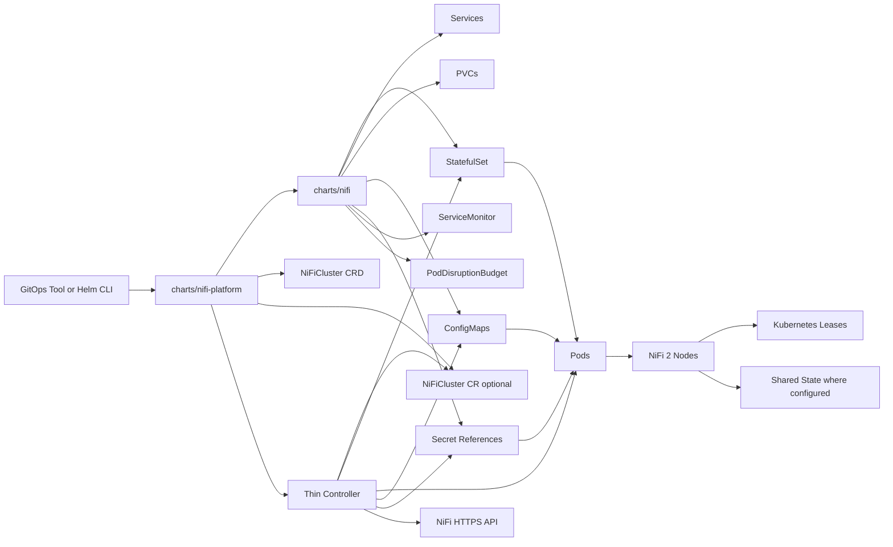

# Architecture

## System Overview

`NiFi-Fabric` separates declarative resource rendering from runtime safety orchestration.

- The product-facing `charts/nifi-platform` chart installs the standard managed platform in one Helm release.
- The reusable `charts/nifi` chart renders and upgrades the standard Kubernetes resources needed to run NiFi 2.x.
- The optional controller watches the rendered workload and applies lifecycle rules that require live cluster state and ordered actions.
- NiFi 2 native Kubernetes support handles coordination, state participation, cluster membership behavior, and TLS autoreload capability.

This design keeps the operational API small and allows teams to use the app chart without adopting the controller, while giving the standard managed path a single product install surface.

## Component Diagram

## Responsibilities

### Control Plane vs Data Plane

| Area | Responsibilities |
| --- | --- |
| Control plane | Helm rendering, controller reconciliation, status conditions, drift detection, restart and hibernation orchestration |
| Data plane | NiFi pods, persistent repositories, Services, NiFi cluster traffic, NiFi HTTPS API |

### Helm Responsibilities

Helm owns both install layers, with a deliberate split:

- `charts/nifi-platform` owns the top-level product install surface for the standard managed path
- `charts/nifi` owns the reusable NiFi workload and config rendering layer

`charts/nifi-platform` owns:

- packaging the `NiFiCluster` CRD
- controller namespace creation when requested
- controller ServiceAccount, RBAC, and Deployment
- managed-mode `NiFiCluster` creation
- dependency wiring for the reusable `charts/nifi` app chart

`charts/nifi` owns:

- `StatefulSet`
- all Services and headless Services
- PVC templates and volume mounts
- `ConfigMap` templates for NiFi configuration
- templated NiFi authentication and authorization files
- prepared Flow Registry Client catalog rendering for external Git-based providers
- references to TLS and authentication Secrets
- `PodDisruptionBudget`
- `ServiceMonitor`
- affinity, tolerations, node selectors, topology spread, security context, and probe configuration
- Ingress and OpenShift Route guidance or templates when included
- RBAC required by NiFi to use Kubernetes coordination and state features
- optional cert-manager resources or references

The platform chart does not absorb app templating, and the app chart does not absorb controller or CRD ownership.

Helm also owns NiFi image selection and compatibility overlays:

- the chart defaults to a small proven baseline image tag
- examples can override `image.tag` for focused compatibility proofs
- examples can also provide additive focused test overlays that reduce replica count, heap, pod resources, and PVC sizes for local kind validation without changing the proven baseline profiles
- the controller does not branch behavior by NiFi minor version
- newer NiFi versions should only be claimed after a focused runtime proof is recorded
- the private-alpha baseline gate remains the authoritative lifecycle proof; focused fast overlays are for narrower reruns only

Helm does not own runtime sequencing decisions after the rendered workload exists.

Authentication and authorization stay chart-first:

- Helm selects one NiFi authentication mode at a time and renders the corresponding NiFi config files.
- Helm enforces one strict auth/authz pairing at a time through render-time validation.
- Helm renders the authorizer composition, application group seed, and file-managed policy seed.
- Helm renders proxy-host and external exposure settings needed for OIDC or LDAP browser access.
- The controller does not provision users, write back identity state, or participate in authentication flows.

Flow Registry Client preparation also stays chart-first:

- Helm can render validated prepared definitions for GitHub, GitLab, Bitbucket, and Azure DevOps Flow Registry Clients.
- Helm does not auto-create those clients in NiFi.
- The controller does not manage registry clients, imported flows, or synchronization.
- There are no flow CRDs.

### Controller Responsibilities

The controller owns:

- resolving the target workload from `NiFiCluster.spec.targetRef.name`
- validating that the target is a same-namespace `StatefulSet`
- computing aggregate hashes for watched Secrets and ConfigMaps
- setting and updating `NiFiCluster.status`
- coordinating health-gated rolling restarts
- coordinating NiFi disconnect and offload sequencing before managed pod deletion or scale-down
- coordinating hibernation and restore from hibernation
- enforcing rollout safety checks
- recording events and exposing controller metrics

The controller does not template workloads, own Helm releases, or become a second values API.

### NiFi Native Responsibilities

NiFi native behavior owns:

- Kubernetes-based cluster coordination
- shared state where configured
- cluster join and rejoin behavior
- TLS autoreload capability

The controller may call the NiFi API to request offload or disconnect actions, but the semantics of cluster membership and node state remain NiFi behavior.

## Product Install Model

There are now two supported Helm entry points with different purposes:

- `charts/nifi-platform` is the default customer-facing install chart
- `charts/nifi` remains the lower-level app chart for standalone or advanced assembly

The standard managed install path is:

1. install `charts/nifi-platform` once
2. let that release install the CRD, controller, app chart, and `NiFiCluster`
3. provide prerequisite Secrets and any cluster dependency such as cert-manager separately when needed

Advanced or evaluator flows may still install the pieces manually, but that is no longer the primary product story.

## Controller-Owned Mutations In Managed Mode

Managed mode is explicit. When `controllerManaged.enabled=true` in the app chart and a `NiFiCluster` exists, the controller owns only these mutations:

- writes to `NiFiCluster.status`
- pod deletions used to advance a controlled `OnDelete` rollout
- updates to `StatefulSet.spec.replicas` for hibernation and unhibernate only
- NiFi API calls that request node offload and disconnect before restart or scale-down

Everything else remains Helm-owned or NiFi-owned.

For GitOps users, the important implication is narrow and documented:

- ignore drift on `StatefulSet.spec.replicas` only if managed hibernation is enabled
- do not ignore template drift, image drift, or configuration drift

## Autoscaling Position

Autoscaling now has two execution scopes on `NiFiCluster`:

- `Advisory`, which stays status-only
- `Enforced`, which is experimental and can execute bounded controller-owned scale actions

The current slice is intentionally conservative:

- `spec.autoscaling.mode` supports `Disabled`, `Advisory`, and `Enforced`
- the controller always computes a recommended replica count first
- advisory mode does not mutate `StatefulSet.spec.replicas`
- enforced mode can change `StatefulSet.spec.replicas` only through the controller, one step at a time
- enforced mode requires `scaleUp.enabled=true`
- experimental automatic scale-down also requires `scaleDown.enabled=true`
- scale-down remains more conservative than scale-up and requires sustained low pressure before any replica reduction
- recommendations are suppressed while rollout, hibernation or restore, degraded state, or other non-steady conditions are active
- enabled signals are typed and surfaced in status with real queue, thread, and CPU samples where NiFi exposes them today
- low-pressure persistence and scale-action timestamps are kept on `NiFiCluster.status`, not in a second autoscaling API surface
- autoscaling resume state for scale-up settle and scale-down prepare or settle is also persisted on `NiFiCluster.status`, so restart recovery does not depend on transient condition text alone
- the focused fast NiFi `2.8.0` runtime proof now covers advisory status-only behavior, one-step enforced scale-up, one-step experimental enforced scale-down, cooldown blocking, and blocked autoscaling during progressing, hibernated or restoring, degraded, unresolved, and unmanaged states
- rollout failure and blocked autoscaling status must still persist even when reconcile returns an error, because degraded autoscaling is only useful if it survives the same failure path the operator is diagnosing

The current autoscaling shape is:

- `Advisory` computes only `status.autoscaling`
- `Enforced` scale-up is opt-in through `scaleUp.enabled=true`
- `Enforced` scale-down is separately opt-in through `scaleDown.enabled=true`
- scale-down uses the same disconnect, offload, and highest-ordinal-first sequencing already used for hibernation
- scale-down uses the same post-removal convergence gate already used for hibernation, so remaining nodes must stay connected and healthy even while NiFi still reports the former node in total-node counts for a short window
- scale-down settlement is sampled and requeued per reconcile instead of holding the single worker inside one long blocking health wait
- cooldown and stabilization remain timestamp-based, while prepare and settle execution state is persisted explicitly so the controller can resume safely after restart or requeue
- scale-down does not run while rollout, TLS restart, hibernation, restore, degraded state, or target-resolution problems are active
- scale-down requires a healthy converged cluster and a sustained low-pressure window before the controller prepares a node
- scale-down still runs only one step per decision and waits for that reduced replica count to settle before any new autoscaling decision is eligible

Autoscaling is still not a trivial extension of the current managed design.

Kubernetes and KEDA can both scale a `StatefulSet`, but both approaches ultimately act by changing the workload replica count through the Kubernetes scale interface. That works well for stateless workloads, but it is not a sufficient control plane for NiFi because scale-down is a destructive lifecycle action, not just a capacity change.

NiFi documents node decommission as an ordered sequence:

1. disconnect the node
2. offload the node
3. delete the node
4. stop or remove the service

That sequence lines up with the controller’s current managed rollout and hibernation model. A direct autoscaler that mutates `StatefulSet.spec.replicas` as its primary action would bypass the existing safe-step coordinator and create a second lifecycle control plane.

For this platform, the intended long-term direction is:

- metrics or an autoscaler may recommend desired capacity
- the recommendation should be written to the `NiFiCluster` control plane, not directly to the `StatefulSet`
- the existing controller should decide whether the cluster is in a state where scaling is safe
- the controller should execute ordered scale actions using the same health gates and NiFi API choreography already used for managed destructive steps
- automatic scale-down remains experimental until that same controller-owned choreography is proven against interrupted restarts, stuck offload, PVC retention, and hibernation or restore interactions together

This keeps the controller thin while preserving one place that owns destructive coordination.

### Candidate Approaches

#### Direct HPA on the StatefulSet

Pros:

- uses only built-in Kubernetes APIs
- well understood for CPU, memory, custom metrics, and external metrics
- no extra operator dependency beyond the cluster metrics pipeline

Cons for NiFi:

- HPA writes replica changes directly to the target scale subresource
- it has no concept of NiFi disconnect, offload, or delete sequencing
- CPU and memory are secondary symptoms for NiFi and can miss queue pressure or flow stalls
- managed mode currently documents controller ownership of replica changes only for hibernation and restore, so direct HPA would conflict with that ownership model
- GitOps guidance for replica drift would become broader and less explainable

Recommendation:

- not recommended as the first implementation architecture
- at most useful later as a metric-calculation source feeding intent, not as the primary scale executor

#### KEDA as the Primary Autoscaler

Pros:

- supports scaling `StatefulSet` targets through `ScaledObject`
- supports external and custom trigger models
- can compose multiple triggers and pause scale-in or scale-out

Cons for NiFi:

- introduces extra CRDs and another autoscaling controller
- still relies on generated HPA behavior for `1..N` scaling and direct target mutation
- does not understand NiFi offload, disconnect, repository locality, or highest-ordinal-first removal
- creates a second lifecycle API surface unless carefully constrained
- makes the first autoscaling slice larger than this platform should accept

Recommendation:

- optional trigger source later
- discouraged as the first implementation path
- if adopted later, use it to recommend capacity intent, not to own the `StatefulSet` replica field directly

#### Custom Controller-Driven Autoscaling

Pros:

- can reuse the existing health gate, node preparation, and safe destructive-step logic
- can make scale-down use the same disconnect and offload choreography already required elsewhere
- keeps one lifecycle control plane
- can prefer NiFi-native signals over generic host metrics

Cons:

- higher implementation and testing burden than HPA-only or KEDA-only
- easy to overbuild into NiFiKop-style feature sprawl if the scope is not constrained
- requires careful status, rate-limiting, hysteresis, and resume behavior design

Recommendation:

- this is the right execution plane if autoscaling is implemented
- keep it narrow: desired capacity intent, health gating, and safe ordinal actions only
- do not expand into flow-aware or policy-rich orchestration

#### Advisory-Only Autoscaling

Pros:

- lowest-risk first step
- proves metric usefulness before allowing destructive automation
- can surface recommendations in `NiFiCluster.status`, events, and metrics without changing replicas
- keeps hibernation, restore, and rollout logic untouched while the signal model is validated

Cons:

- does not reduce operator toil yet
- still requires design for how advice is produced and consumed

Recommendation:

- recommended phase 1

Current implementation note:

- advisory evaluation is now implemented in the controller status plane
- the real signal slice stays read-only and reuses the existing NiFi API auth and trust path
- root-process-group queued FlowFiles and queued bytes are collected from NiFi flow status
- timer-driven thread counts are collected from NiFi system diagnostics and used to decide whether queue pressure is actionable
- CPU is sampled from NiFi system diagnostics as a secondary advisory signal, not the primary pressure source
- the controller keeps recommendation output bounded
- advisory mode remains read-only
- enforced mode can apply a bounded one-step scale-up only after the same steady-state health gate passes
- enforced mode can also apply a bounded one-step experimental scale-down only after the same steady-state health gate passes, sustained low pressure is recorded, and NiFi node preparation completes

### NiFi-Specific Constraints

Any future autoscaling design has to respect these existing runtime facts:

- scale-up is safer than scale-down, but still changes cluster size and flow-election expectations
- scale-down is destructive and must preserve the disconnect, offload, delete sequence
- repository PVCs are per-pod and ordinal-bound, so replica reduction is not equivalent to stateless pod eviction
- orphaned or stale per-ordinal PVC state must be treated carefully on re-expansion
- hibernation and autoscaling must not fight over `StatefulSet.spec.replicas`
- managed rollout, TLS drift handling, and autoscaling should reuse the same health-gated destructive-step coordinator instead of inventing parallel logic

### Recommended Phasing

#### Phase 1: Advisory Only

- no automatic replica mutation
- compute and publish recommended capacity and reason
- surface the recommendation through `NiFiCluster.status`, controller metrics, and events
- use NiFi-native pressure signals first
- start with root-process-group backlog plus timer-driven thread saturation
- keep queue-age and richer stuck-backlog analysis as future work until they can be gathered reliably

#### Phase 2: Optional Experimental Scale-Up Only

- require managed mode
- allow only bounded scale-up
- keep scale-down disabled
- have the controller execute replica increases after cluster-health prechecks
- take only one scale-up step per reconcile
- require an explicit cooldown between scale-up actions
- record the last scaling decision and last scale-up timestamp in the existing control plane

#### Phase 3: Scale-Down Only After Safe Coordination Is Proven

- require a completed design for disconnect, offload, and delete sequencing during autoscaling
- require explicit interaction rules with hibernation and restore
- require resume-safe status for interrupted scale-down
- require focused proof for partial failure, stuck offload, controller restart, and GitOps interaction

### Minimum Signals For Implementation

Prefer NiFi-native pressure indicators over generic host metrics:

- queued FlowFiles
- queued bytes
- queue age or sustained backlog age
- active thread saturation
- node connectivity and cluster convergence state
- repository pressure and disk headroom where observable

Use CPU only as a secondary signal:

- CPU can help confirm sustained pressure
- CPU alone should not trigger scale-down
- CPU alone should not be the primary trigger for scale-up on a dataflow system

Current collection gap:

- queued FlowFiles, queued bytes, timer-driven thread counts, and secondary CPU diagnostics are now collected from NiFi
- sustained queue age is still future work
- broader repository-pressure or stuck-backlog signals are still future work
- the platform still does not claim precision beyond what NiFi exposes through the current read-only API surface

### Future API Direction

If autoscaling is later implemented, prefer extending the existing `NiFiCluster` control plane rather than introducing a new CRD.

The future shape should be small and explainable:

- desired capacity intent
- autoscaling mode such as `Disabled`, `Advisory`, or `Enforced`
- explicit scale-up and scale-down policy toggles
- bounded min and max replicas
- minimal cooldown configuration
- status for recommended replicas, active signal summary, and the last scaling decision

That keeps the API boring and avoids introducing a second product surface for NiFi lifecycle control.

## Interaction Flows

### Install

1. GitOps or Helm applies either the platform chart or the standalone app chart.
2. For the standard managed path, the platform chart installs the CRD, controller resources, app chart, and `NiFiCluster` in one release.
3. The app chart renders the `StatefulSet`, Services, PVCs, config, and references to TLS material.
4. NiFi nodes start and form a cluster using Kubernetes-native coordination.
5. If managed mode is enabled, the controller resolves the target workload and sets initial status conditions.

### Config Drift

1. A watched `ConfigMap` changes.
2. Helm or GitOps updates the desired pod template.
3. The controller detects template or watched-resource drift.
4. The controller waits for cluster health gates.
5. The controller disconnects and offloads the target NiFi node, then deletes one pod and waits for the new pod to become Ready and rejoin before continuing.

### Cert Rotation

1. cert-manager renews the certificate Secret.
2. The controller detects TLS-related drift across watched Secrets and the target pod template.
3. If refs, paths, and passwords are unchanged, the controller prefers an autoreload-first observation window.
4. If refs, paths, or passwords changed, or health degrades, or restart policy requires it, the controller performs a controlled rolling restart.

### Upgrade

1. Helm or GitOps updates the NiFi image or configuration.
2. In managed mode the `StatefulSet` uses `OnDelete`.
3. The controller observes the new desired revision.
4. The controller rolls pods one ordinal at a time after cluster and pod health checks pass.

### Hibernation

1. `NiFiCluster.spec.desiredState` becomes `Hibernated`.
2. The controller records `status.hibernation.lastRunningReplicas` and preserves a non-zero restore baseline in status.
3. If health gating is required, the controller waits for the documented per-pod health signal.
4. The controller reduces `StatefulSet.spec.replicas` toward zero while preserving PVCs.
5. The controller sets `Hibernated=True` when the cluster is quiesced and scaled down.

### Restore From Hibernation

1. `NiFiCluster.spec.desiredState` becomes `Running`.
2. The controller restores the prior replica count from `status.hibernation.lastRunningReplicas`.
3. If that field is absent, the controller falls back to the preserved non-zero baseline in `status.hibernation.baselineReplicas`.
4. The controller falls back to `1` replica only if both status hints are absent.
5. The controller waits for pods to become Ready and for cluster convergence to stabilize again.
6. The controller clears hibernation progress once the prior running shape is restored.

Current implementation note:

- the current hibernation slice reduces replicas one ordinal at a time after NiFi reports the target node as offloaded

## Why This Is Not NiFiKop

NiFiKop is useful as a source of operational lessons, especially around rollout safety and NiFi lifecycle handling. This project intentionally diverges in three ways:

- the app chart remains first-class and standalone
- the platform chart gives the standard managed path a single product install surface without expanding controller scope
- the operational API stays thin and does not try to model all NiFi concerns
- NiFi 2 native Kubernetes behavior replaces features that older designs had to recreate

## References

- Apache NiFi Administration Guide: https://nifi.apache.org/documentation/nifi-latest/html/administration-guide.html
- Apache NiFi REST API: https://nifi.apache.org/nifi-docs/rest-api.html
