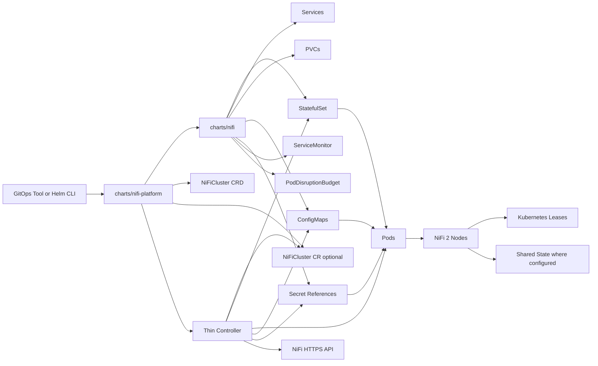

# Architecture

## System Overview

`NiFi-Fabric` separates declarative resource rendering from runtime safety orchestration.

- The product-facing `charts/nifi-platform` chart installs the standard managed platform in one Helm release.
- The reusable `charts/nifi` chart renders and upgrades the standard Kubernetes resources needed to run NiFi 2.x.
- The optional controller watches the rendered workload and applies lifecycle rules that require live cluster state and ordered actions.
- NiFi 2 native Kubernetes support handles coordination, state participation, cluster membership behavior, and TLS autoreload capability.

This design keeps the operational API small and allows teams to use the app chart without adopting the controller, while giving the standard managed path a single product install surface.

## Component Diagram

## Responsibilities

### Control Plane vs Data Plane

| Area | Responsibilities |
| --- | --- |
| Control plane | Helm rendering, controller reconciliation, status conditions, drift detection, restart and hibernation orchestration |
| Data plane | NiFi pods, persistent repositories, Services, NiFi cluster traffic, NiFi HTTPS API |

### Helm Responsibilities

Helm owns both install layers, with a deliberate split:

- `charts/nifi-platform` owns the top-level product install surface for the standard managed path
- `charts/nifi` owns the reusable NiFi workload and config rendering layer

`charts/nifi-platform` owns:

- packaging the `NiFiCluster` CRD
- controller namespace creation when requested
- controller ServiceAccount, RBAC, and Deployment
- managed-mode `NiFiCluster` creation
- dependency wiring for the reusable `charts/nifi` app chart

`charts/nifi` owns:

- `StatefulSet`
- all Services and headless Services
- PVC templates and volume mounts
- `ConfigMap` templates for NiFi configuration
- templated NiFi authentication and authorization files
- prepared Flow Registry Client catalog rendering for external Git-based providers
- references to TLS and authentication Secrets
- `PodDisruptionBudget`
- `ServiceMonitor`
- affinity, tolerations, node selectors, topology spread, security context, and probe configuration
- Ingress and OpenShift Route guidance or templates when included
- RBAC required by NiFi to use Kubernetes coordination and state features
- optional cert-manager resources or references

The platform chart does not absorb app templating, and the app chart does not absorb controller or CRD ownership.

Helm also owns NiFi image selection and compatibility overlays:

- the chart defaults to a small proven baseline image tag
- examples can override `image.tag` for focused compatibility proofs
- examples can also provide additive focused test overlays that reduce replica count, heap, pod resources, and PVC sizes for local kind validation without changing the proven baseline profiles
- the controller does not branch behavior by NiFi minor version
- newer NiFi versions should only be claimed after a focused runtime proof is recorded
- the private-alpha baseline gate remains the authoritative lifecycle proof; focused fast overlays are for narrower reruns only

Helm does not own runtime sequencing decisions after the rendered workload exists.

Authentication and authorization stay chart-first:

- Helm selects one NiFi authentication mode at a time and renders the corresponding NiFi config files.
- Helm enforces one strict auth/authz pairing at a time through render-time validation.
- Helm renders the authorizer composition, application group seed, and file-managed policy seed.
- Helm renders proxy-host and external exposure settings needed for OIDC or LDAP browser access.
- The controller does not provision users, write back identity state, or participate in authentication flows.

Flow Registry Client preparation also stays chart-first:

- Helm can render validated prepared definitions for GitHub, GitLab, Bitbucket, and Azure DevOps Flow Registry Clients.
- Helm does not auto-create those clients in NiFi.
- The controller does not manage registry clients, imported flows, or synchronization.
- There are no flow CRDs.

### Controller Responsibilities

The controller owns:

- resolving the target workload from `NiFiCluster.spec.targetRef.name`
- validating that the target is a same-namespace `StatefulSet`
- computing aggregate hashes for watched Secrets and ConfigMaps
- setting and updating `NiFiCluster.status`
- coordinating health-gated rolling restarts
- coordinating NiFi disconnect and offload sequencing before managed pod deletion or scale-down
- coordinating hibernation and restore from hibernation
- enforcing rollout safety checks
- recording events and exposing controller metrics

The controller does not template workloads, own Helm releases, or become a second values API.

### NiFi Native Responsibilities

NiFi native behavior owns:

- Kubernetes-based cluster coordination
- shared state where configured
- cluster join and rejoin behavior
- TLS autoreload capability

The controller may call the NiFi API to request offload or disconnect actions, but the semantics of cluster membership and node state remain NiFi behavior.

## Product Install Model

There are now two supported Helm entry points with different purposes:

- `charts/nifi-platform` is the default customer-facing install chart
- `charts/nifi` remains the lower-level app chart for standalone or advanced assembly

The standard managed install path is:

1. install `charts/nifi-platform` once
2. let that release install the CRD, controller, app chart, and `NiFiCluster`
3. provide prerequisite Secrets and any cluster dependency such as cert-manager separately when needed

Advanced or evaluator flows may still install the pieces manually, but that is no longer the primary product story.

## Controller-Owned Mutations In Managed Mode

Managed mode is explicit. When `controllerManaged.enabled=true` in the app chart and a `NiFiCluster` exists, the controller owns only these mutations:

- writes to `NiFiCluster.status`
- pod deletions used to advance a controlled `OnDelete` rollout
- updates to `StatefulSet.spec.replicas` for hibernation and unhibernate only
- NiFi API calls that request node offload and disconnect before restart or scale-down

Everything else remains Helm-owned or NiFi-owned.

For GitOps users, the important implication is narrow and documented:

- ignore drift on `StatefulSet.spec.replicas` only if managed hibernation is enabled
- do not ignore template drift, image drift, or configuration drift

## Interaction Flows

### Install

1. GitOps or Helm applies either the platform chart or the standalone app chart.
2. For the standard managed path, the platform chart installs the CRD, controller resources, app chart, and `NiFiCluster` in one release.
3. The app chart renders the `StatefulSet`, Services, PVCs, config, and references to TLS material.
4. NiFi nodes start and form a cluster using Kubernetes-native coordination.
5. If managed mode is enabled, the controller resolves the target workload and sets initial status conditions.

### Config Drift

1. A watched `ConfigMap` changes.
2. Helm or GitOps updates the desired pod template.
3. The controller detects template or watched-resource drift.
4. The controller waits for cluster health gates.
5. The controller disconnects and offloads the target NiFi node, then deletes one pod and waits for the new pod to become Ready and rejoin before continuing.

### Cert Rotation

1. cert-manager renews the certificate Secret.
2. The controller detects TLS-related drift across watched Secrets and the target pod template.
3. If refs, paths, and passwords are unchanged, the controller prefers an autoreload-first observation window.
4. If refs, paths, or passwords changed, or health degrades, or restart policy requires it, the controller performs a controlled rolling restart.

### Upgrade

1. Helm or GitOps updates the NiFi image or configuration.
2. In managed mode the `StatefulSet` uses `OnDelete`.
3. The controller observes the new desired revision.
4. The controller rolls pods one ordinal at a time after cluster and pod health checks pass.

### Hibernation

1. `NiFiCluster.spec.desiredState` becomes `Hibernated`.
2. The controller records `status.hibernation.lastRunningReplicas` and preserves a non-zero restore baseline in status.
3. If health gating is required, the controller waits for the documented per-pod health signal.
4. The controller reduces `StatefulSet.spec.replicas` toward zero while preserving PVCs.
5. The controller sets `Hibernated=True` when the cluster is quiesced and scaled down.

### Restore From Hibernation

1. `NiFiCluster.spec.desiredState` becomes `Running`.
2. The controller restores the prior replica count from `status.hibernation.lastRunningReplicas`.
3. If that field is absent, the controller falls back to the preserved non-zero baseline in `status.hibernation.baselineReplicas`.
4. The controller falls back to `1` replica only if both status hints are absent.
5. The controller waits for pods to become Ready and for cluster convergence to stabilize again.
6. The controller clears hibernation progress once the prior running shape is restored.

Current implementation note:

- the current hibernation slice reduces replicas one ordinal at a time after NiFi reports the target node as offloaded

## Why This Is Not NiFiKop

NiFiKop is useful as a source of operational lessons, especially around rollout safety and NiFi lifecycle handling. This project intentionally diverges in three ways:

- the app chart remains first-class and standalone
- the platform chart gives the standard managed path a single product install surface without expanding controller scope
- the operational API stays thin and does not try to model all NiFi concerns
- NiFi 2 native Kubernetes behavior replaces features that older designs had to recreate

## References

- Apache NiFi Administration Guide: https://nifi.apache.org/documentation/nifi-latest/html/administration-guide.html
- Apache NiFi REST API: https://nifi.apache.org/nifi-docs/rest-api.html
